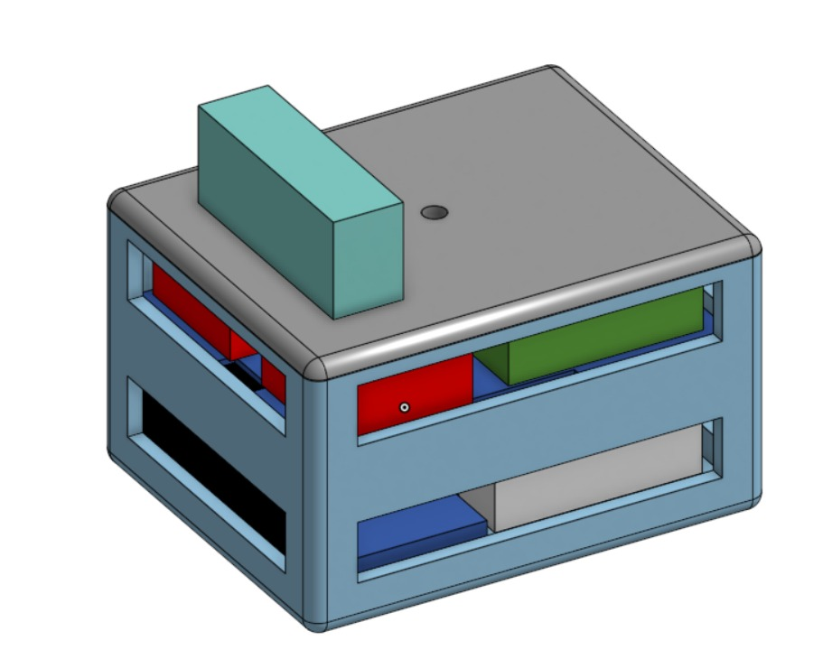

# Caixa de Eletrônicos — V1

  

Primeira versão da caixa dos eletrônicos, em corpo único. Modelos CAD na pasta:
`Caixa-V1.step` e `Caixa-V1.x_t`. Substituída pela [V2](../V2/README.md), em
andares empilháveis.
